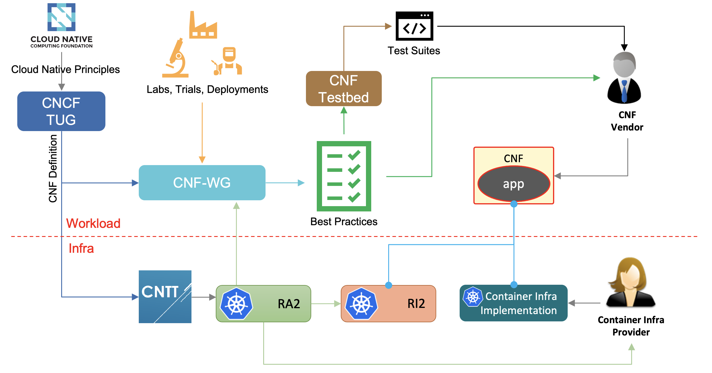
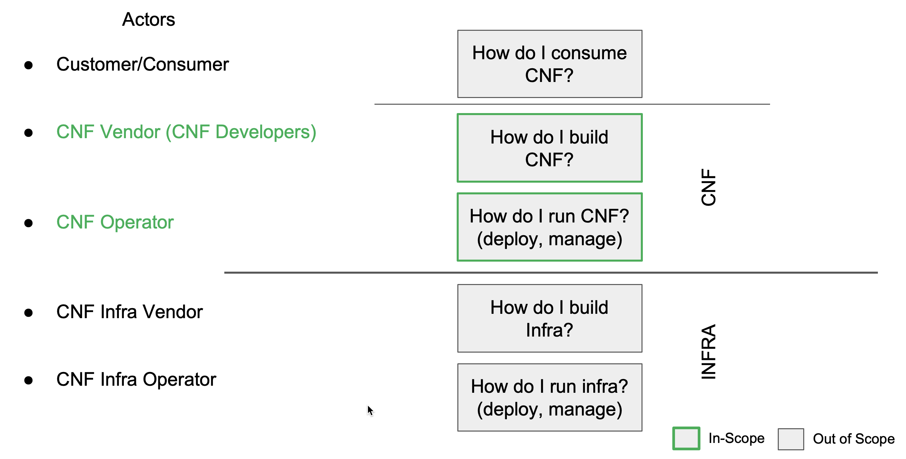

# CNF Working Group

## Table of Contents

* [Introduction](#introduction)
* [Scope](#scope)
* [Best Practices for CNF Developers](#best-practices-for-cnf-developers)

## Introduction

The goal of this group is to define a set of practices to evaluate the extent to which a CNF is [cloud native](https://github.com/cloud-native-principles/cloud-native-principles). CNFs can be evaluated against those best practices through test cases that are developed by other open source projects like the [CNF Test Suite](https://github.com/cncf/cnf-testsuite#cnf-conformance-test-suite).

CNF WG will rely on other industry initiatives (such as CNCF TUG) to come up with a definition of "cloud native" in relation to the telecom industry.

As the telco industry transitions to cloud native ways of thinking, working, and operating, these best practices will serve as the industry gold standard of what cloud native means in practice. They can be used for a variety of purposes including guiding CNF design and development, in RFPs, to guide daily operations, and to do internal testing.

Cloud native is not a set point. The industry, technology, and best practices will continually evolve with each other. Thus, being cloud native should not be seen as pass/fail, but rather a spectrum. While it may be impossible for anything to be completely cloud native, implementing even one best practice can help improve business outcomes for everyone involved. Implementing more of them can have an even greater impact. However, depending upon the type of CNF, different best practices may have a greater or smaller impact on the ultimate business outcome.

These best practices and recommendations shall serve as generic contract between CNFs and cloud native infrastructure / platforms. If both, a CNF and a platform follow these recommendations it should be assured that they will run nicely together out-of-box. In a sense fulfilling this contract represents implicit (pre) certification that the combination can be used in the production.

Best practices are introduced, modified, and removed to keep up with industry trends and technological advances via a process defined in [here](cbpps).

**Figure 1-1** below illustrate CNF WG relation to other communities and how best practices defined by CNF WG are consumed.

## Scope

As demonstrated by **Figure 1-2** below, When it comes to Cloud Native Network Functions (CNFs), there are many areas that can be focused on in order to determine different best practices for different Actors. They are:

* **Consumption of CNFs**: Set of best practices that helps Customers/Consumers to consume and use CNFs in a cloud native way.
* **Development of CNFs**: Set of best practices that helps CNF Developers to build their CNFs in a cloud native way.
* **Operation of CNFs**: Set of best practices that helps CNF Operators with the lifecycle management of CNFs in a cloud native way (for example, deployment, configuration management, upgrade, etc).
* **Building of CNF Infrastructure**: Set of best practices that helps CNF Infrastructure developers to build and develop CNF Infrastucture in a cloud native way.
* **Operation of CNF Infrastructure**: Set of best practices that helps CNF Infra Operators to deploy and manage CNF infrastructure in cloud native way.

The current focus of CNF WG is to define the best practices for the development and deployment of CNFs. Other areas are left for future focus.

## Best Practices for CNF Developers

* [Configuration and Lifecycle](./best_cnf_dev.md#1.0-configuration-and-lifecycle)
* [Installable and Upgradeable](./best_cnf_dev.md#2.0-installable-and-upgradeable)
* [Hardware support](./best_cnf_dev.md#3.0-hardware-support)
* [Microservice](./best_cnf_dev.md#4.0-microservice)
* [Compatibility](./best_cnf_dev.md#5.0-compatibility)
* [State](./best_cnf_dev.md#6.0-state)
* [Security](./best_cnf_dev.md#7.0-security)
* [Scaling](./best_cnf_dev.md#8.0-scaling)
* [Observability](./best_cnf_dev.md#9.0-observability)
