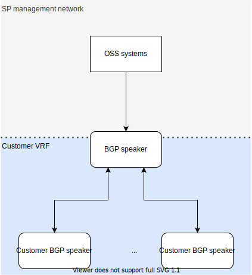

# UC-0002: BGP on a customer network

## Context

### Acronyms

BGP: Border Gateway Protocol.  A TCP-based protocol that shares network routes between devices.

VRF: Virtual Routing and Forwarding.  A context in a network device with its own routing table.  Multiple contexts may be set up in a device.  For instance, in a home network your gateway has two VRFs - the private addresses inside your home and the public internet outside.  These have independent route tables - the internal routes to devices are not shared with the world.  An interface with an address is homed in a particular VRF.

TCP: Transmission Control Protocol.  A common network protocol that endpoints use to talk to each other.
Endpoint: A device that generates and consumes traffic (as constrasted with a device that forwards traffic).

BSD socket API: The historic set of API calls typically offered by an operating system that uses networking.  Includes the function that creates a socket for use (```socket()```), a function to dial out to a remote server (```connect()```), and functions to enable listening for connections (```bind()```, ```listen()```) among others.

CNI: Container Network Interface.  A standard API that provides network functions to Kubernetes.  On deployment, a CNI plugin is installed that provides the CNI to applications on the Kubernetes API endpoint and commits to setting up networking between containers and to the outside world according to defined API semantics.  These semantics are largely focused on reachability ('packets will reach their destination'), as opposed to network implementation (it does not specify if routing, switching or other techniques will be used) and providing networking to containers via the OS kernel's BSO socket APIs.

CRI: Container Runtime Interface.  A standard API for providing runtime features to Kubernetes.  Any container provider (of which there are a number, one common one being Docker) implements the CRI, and the CRI is consumed by Kubernetes when launching containers.

### 'Default' Kubernetes deployment

For the purpose of identifying requirements of this use case that might be shortcomings of a standard Kubernetes deployment, we measure the needs of this use case against a common core of Kubernetes functionality that is likely to be found in any Kubernetes deployment from any provider.  For the purposes of this, we assume the following are available

- Core APIs, as found in Kubernetes version 1.20
- A Kubernetes CNI - we do not dictate which CNI is required, only that it provides expected CNI functionality, so this document does not expect extensions that a particular CNI provides, only the generalised functionality

There are many ways in which deployment choices add functionality, both explicit - such as using a CNI with extensions, beta APIs, controllers and other plugins that add CRDs - and implicit - kernel tuning that might add performance guarantees.  For the purposes of comparison we do not expect any of this functionality.  Designs that satisfy this use case may propose that some extended functionality is available.

## Overview

A service provider wishes to run a BGP server that is attached to a customer network.  This is a common use case when using VPNs.

The customer network is a separate network from the internet, having its own addressing domain (i.e. it is a VRF on the service provider network).  In order to provide BGP service to this network. the BGP application run by the BGP server must peer with other BGP speakers on the customer network, and therefore needs to have an interface within that VRF.  Simultaneously, the BGP speaker will require a management interface (for configuration and telemetry) in the SP network.  The Kubernetes API endpoint will also be in the SP network, unavailable to the customer - the customer's network can _only_ access the BGP speaker.



## Network consumption

In NFV we often consider interfaces that provide per-packet networking for the purposes of creating a fast dataplane.  This, however, is not one of those use cases.  Here, the BGP protocol involves a simple TCP connection, and the kernel network stack provides to the BGP process.  So, note that the BGP peering sessions will be socket-based connections and the BGP speaker will want to consume the network via standard BGP socket APIs (```socket()```, ```listen()``` and ```connect()```).

BGP speakers are true peers, without a client and a server.  Any BGP speaker is expected to listen on a well known port for its neighbours trying to connect.  At the same time, it will be attempting connections to those peers.

The BGP connection is typically described at both ends with the addresses of the opposite end.  The Kubernetes-based BGP speaker process will want to know, and reach, the address of its neighbour.  Similarly the neighbour will want to know, and reach, the address of the BGP speaker.  There is no DNS involved in this lookup.

## Problems vs standard Kubernetes

There are three sorts of networking occurring here.

1. We have the connection used by the OSS systems to the BGP speaker using the management VRF, which is isolated from the SP customer.
1. We have the connection used by the BGP peering sessions to the BGP speaker, using the customer VRF, isolated from other networks.
1. We have whatever internal networking is required between microservices within the BGP speaker (perhaps, for instance, speaker code versus a DB instance storing the RIB).

### CNI-mediated networking

Kubernetes' CNI interface provides for the internal connectivity - this has no fixed protocol and is likely amenable to the semantics of the CNI.  Similarly, the telemetry interface (logging, monitoring and configuration using e.g. a REST interface) will work using the CNI an Kubernetes ingress.

### Networking outside the scope of the CNI

However, the BGP interface will not work using the CNI, for a number of reasons.

#### Multiple VRFs

Kubernetes' CNI is designed to attach to the network outside of the platform using a single point of connectivity - basically, into a single VRF - and the defined APIs do not allow a different connection to be specified for other connections.  All CNI endpoints should be in a single addressing domain that can reach all other endpoints.

### Multiple VRFs attached to one process

Aside from this, if the BGP process is in two VRFs, it, and at least one of its pods, must attach to two routing tables.  This is conventionally done, in Linux, by using two namespaces.  This is problematic for stock Kubernetes.  It creates a namespace for each pod and gives control of it to the CNI, for the purposes of Kubernetes networking.  Kubernetes does not provide a means to create and attach a second namespace.

It is also not possible for an unprivileged container to change namespaces.  A process requires CAP_NET_ADMIN or higher privileges to switch namespaces.  However, CAP_NET_ADMIN is indiscriminate - a process with CAP_NET_ADMIN can do anything to any namespace on the server, regardless of whether it is assigned to the container in which the pod resides.

### BGP is not designed to be cloud-native

BGP far predates Kubernetes and it is not designed with cloud-style failure tolerance in mind.  Its connection is designed to be direct from one BGP process to another, with the assumption that the network provides reachability and nothing else.

BGP peers need to know their own address and the address of their peer.  Address rewrites (e.g. NAT) in the flow are likely to cause problems rather than help the solution.

BGP sessions last as long as the TCP connection is held up.  If the speaker process dies, the interruption in the connection causes a significant event on the network, and having a failover process to accept the connection, while still useful, is not going to avoid that network event and the major part of the disruption caused by the failure.

So: current BGP speakers are not going to be able to make use of standard forms of address rewriting (e.g. NAT) or load balancing from the platform, and in fact these features will cause problems if they cannot be avoided.  If BGP requires special network functionality it is likely to be specific to the application and therefore built into the application, not general purpose enough to be worth building into the platform.
