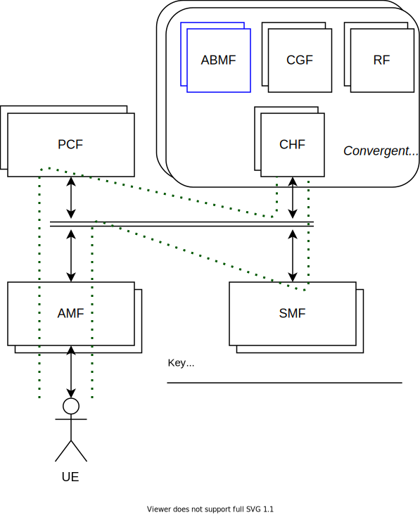
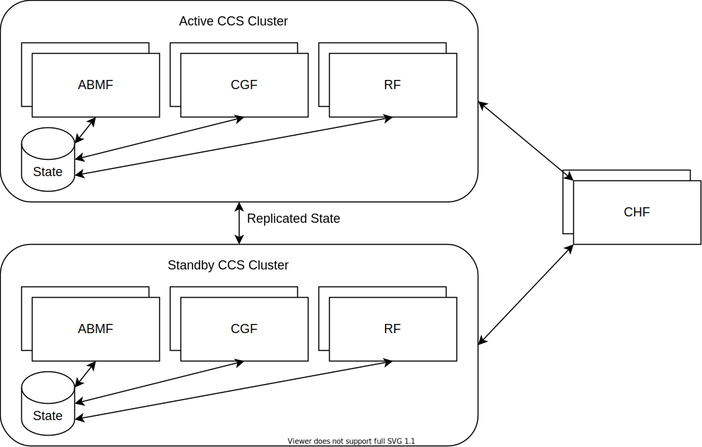

# UC-0003: Network Functions that maintain State

**NOTE:**  
In a 5G network the Convergent Charging System (CCS) comprises several autonomous business functions, including the Account Balance Management Function (ABMF) to manage state. This use case covers Stateful CNFs such as the ABMF.

## Glossary

> Provide definitions for technical terms and acronyms.

- State - long lived or short lived
  - examples of long-lived state objects are: Balance, Subscriber, Device, Quota, Price-plan
  - examples of short-lived state objects are: Session
- CCS - 5G Convergent Charging System (contains the CHF, ABMF, CGF, RF)
- CHF - Charging Function, handles the charging requests on behalf of the CCS
- PCF - The Policy Control Function provides policy rules to other CNFs (such as AMF, CHF)
- ABMF - Account Balance Management Function, part of the CCS. The Stateful CNF.
- CGF - Charging Gateway Function, part of the CCS
- RF - Rating Function, part of the CCS
- Session - a short-lived record of a specific series of requests by a device to use the network (SMF, Session Management)
- Price Plan - the collection of rules controlling how the charging sessions should be processed
- Quota - a long-lived record of how much time/data the device can use / has used on the network
- Balance - a long-lived record of available funds (allowances) grouped into balance types with units such as time, data, currency
- Subscriber - a subscription to use the network services which may be associated with an individual customer or a company, a subscriber has one or more devices
- Device - the device (UE) that the subscriber uses to access the network (AMF, Access Management), may have its own balances and allowances
- Executor - the micro-service within the CCS that processes charging session requests (CGF, Charging Gateway), querying balances (ABMF, Account Balance) and recording quotas (RF, Rating)
- CCS Cluster - a collection of micro-service executors that work together to handle charging session requests (CHF, CGF), balance queries (ABMF) and quota records (RF)

## Involved processes

> Please uncomment and/or add key processes that are involved in the use case you are presenting. This helps actors to decide if the use case is relevant for them or not.

- [ ] Development
- [ ] Deployment
- [X] System integration 
  - The collaboration of the Stateful CNF with other CNFs, examples:
    - The 5G network elements that precede the Stateful CNF
    - The external systems that consume the event stream
- [X] Network integration
  - The Stateful CNF communicates with the wider network in real-time
- [ ] Lifecycle management
- [ ] Operations

## Involved actors / personas

> List main actors / personas involved in the use case. For example:

- The Subscriber whose state is maintained by the Stateful CNF
- The Business Owner that is providing service using the CNF
- The Business Function (Data warehouse, GL) that is receiving the event stream from the Stateful CNF

## Involved system entities

> List system entities that are involved in the use case. For example:

- The fast persistent shared volumes that will maintain the Stateful CNF state at rest
  - Example: database checkpoints and snapshots
- The system memory in which the live state will reside for the running Stateful CNF
- The network infrastructure used to connect to the Stateful CNF

## Situation

> Describe situation related to this use case. Indicate what are intents and expectations of different parties as well as the roles and requirements of different system components. Explain how everything is related. Drawings, flow and system diagrams are beneficial here. This part shall give the reader clear overview of the situation as the starting point for evaluation of the use case. It should not contain the detailed technical descriptions and analysis.

### Use Case Scenario: A subscription has a device that requests quota to use the network

- Precondition: A subscription and an associated device have been provisioned in the Stateful CNF
- Primary steps:
  1. A device subscription makes a real-time request to the network for quota by starting a charging session, the network sends the request through various CNFs until it reaches the Stateful CNF
  2. The Stateful CNF verifies that the subscription is valid, if it has sufficient balance the Stateful CNF allocates some quota, the successful response is returned through the network of CNFs to the device
  3. When the quota has expired (either through usage or time), a real-time request for additional quota is sent for the same charging session, either sent from the Stateful CNF through the network of CNFs to the device or from the device through the network of CNFs to the Stateful CNF
  4. At the end of the device's usage scenario, the device sends a final real-time request to the network completing the charging session, the Stateful CNF can calculate the total charge associated with the charging session
- Postconditions:
  1. A charge event for the charging session is generated
  2. The event is streamed to external systems so that the event can be included in the subscriber's monthly bill
- Alternate steps:
  1. After the charging session for the initial quota request has expired a subsequent quota request is sent through the network of CNFs to the Stateful CNF
  2. The Stateful CNF cannot allocate enough quota and ends the charging session, an error is returned through the network of CNFs to the device
  3. The device closes the network session (applications running on the device may prompt the user to act on the failed network request by topping up their account)
- Exceptional steps:
  1. After the charging session has been established with an initial quota request, the device is disconnected from the network (such as if it roams into a different network)
  2. The network informs the Stateful CNF through the network of CNFs that the device is no longer connected, the Stateful CNF calculates the usage based on previously granted quota and generates an event for the charging session

### Why do we need to maintain state?

- A 5G Real-Time Convergent Charging System has to maintain the account balances and usage quotas of active subscriptions
- We need to be able to accurately reflect the Balance for a Subscription across the account's lifetime (Like a bank)
- The state should be preserved in the event of a catastrophic failure
- State should be available across the cluster to all stateless CNFs that need to access it 

### Why does it need to be low-latency?

- The Service Provider needs to be able to take action in real-time (ultra low latency: less than a millisecond end-to-end) for whether to allow the device to use a network resource or not
- A liability or opportunity - Service Provider needs to respond quickly to keep their customers happy, these are the expectations of a true digital experience
- Lack of a real-time decision exposes the Service Provider to potential financial loss
- Ultra low latency charging decisions based on stateful data are necessary to inform other policy decisions by the service provider, for example changing the quality of service level

### Why do we need to achieve high throughput?

- A Service Provider may maintain the balances and quotas for millions of devices, many of which may access the Stateful CNF concurrently

## Expected behaviour

> Provide detailed technical descriptions and depict expected behaviour of system entities and components regardless of cloud nativeness. Highlight what are different entities expected to provide. Depending on the use case you can look at it from different angles e.g. CNF angle, Cloud Native Platform angle, Network angle etc. This section should give the reader clear understanding of expected behaviour.

- The state that is a maintained by the Stateful CNF must remain ACID complaint, a convergent charging system handles real-time financial transactions
  - Atomicity: it should be possible to make a binary yes/no decision (at any point in time) for whether a subscriber's device is allowed to use the network, if a subscriber requests quota but they do not have sufficient balance then their account should not modified
  - Consistency: if the value of a subscriber's balance is X then it should remain at X if there are no external changes that could affect it, there should be a defined set of business rules that are applied when making changes that may affect a subscriber's balance, such as when a device is requesting new quota
  - Isolation: a subscriber may be making charges on their account while at the same time topping up the balance, all of these transactions should be applied independently but should result in a consistent view of the subscriber's account
  - Durability: all changes to a subscriber's account should be maintained through any interruptions to the CNF, such as a pod or node failure or cluster maintenance

- The Stateful CNF should be resilient and scalable
  - The Stateful CNF should continue to follow cloud-native principles:
    - Node failure should not result in service outage
    - The Stateful CNF should be able to scale up and down to handle traffic spikes
    - The Stateful CNF should be upgradable at any time
  - The Stateful CNF should be portable across different hosts and clusters
    - The Stateful CNF instances should be loosely coupled to the host infrastructure: they should not be tied to a single node, instead taints and tolerations should be used to select nodes with the necessary capabilities
    - The Stateful CNF may have specific resource requirements (memory size, CPU %, PV speed) and may also use affinity rules to control the scheduling of the Stateful CNF pods across the kubernetes cluster

## Challenges and limitations with Kube-native approach

> This section will give us main inputs for discussion and evaluation of best practices. Describe which challenges and limitations kube-native approach presents for this use case. Provide technical details about what is not possible with kube-native approach and elaborate why is that relevant. If there are some established practices that are used to work around these limitations please describe those in the chapter below*

In a kube-native environment the Stateful CNF cannot mandate the specific nodes on which it is to execute, therefore it has to rely on the rules provided by the Kubernetes platform to allow the CNF Operator to configure the resource requirements, using affinity rules, tolerations and taints within the deployment to control how the Stateful CNF spreads across the available nodes in the cluster.

Where the short lived state for a Stateful CNF is stored in memory, it can be challenging to move the workload from one node to another (in the scenario where a node is being taken out of a cluster for maintenance). All ongoing charging sessions must be completed before any move can take place, in addition the Stateful CNF should maintain an active cluster of available executors that are able to handle the processing for new charging sessions which must be started on alternate nodes. In the case of a node failure, the short lived state must have been replicated to other nodes in the executor cluster to allow them to take over the management of the charging sessions.

Where the long lived state for a Stateful CNF is held in memory, the state must also be backed-up to persistent storage to handle the situation where a node failure results in the total loss of the contents of the node's memory. The Stateful CNF should maintain an active cluster of executors that can handle requests from Subscribers to allow the current values of the long-lived state to be retrieved from any node in the cluster.

### Established practices to overcome challenges and limitations

> If such practices exist please elaborate them here in sufficient technical details. Provide references and give your opinion weather or not these practices can be considered as candidates for CNF best practices in line with [CBPP description](../cbpps/0001-cnf-best-practice-proposal-process.md).

*N/A (TBD)*

### What needs to be done differently in order to overcome challenges and limitations

> If there are no established practices and you have ideas or if you believe things related to this use case should be done differently please indicate it shortly here. The purpose of this is to earmark some potential inputs for CBPP process. It is not expected to elaborate CBPPs here.

A Stateful CNF should exhibit the following cloud native properties:

- Scalable
- Resilient
- Portable (loosely coupled to the host infrastructure)
